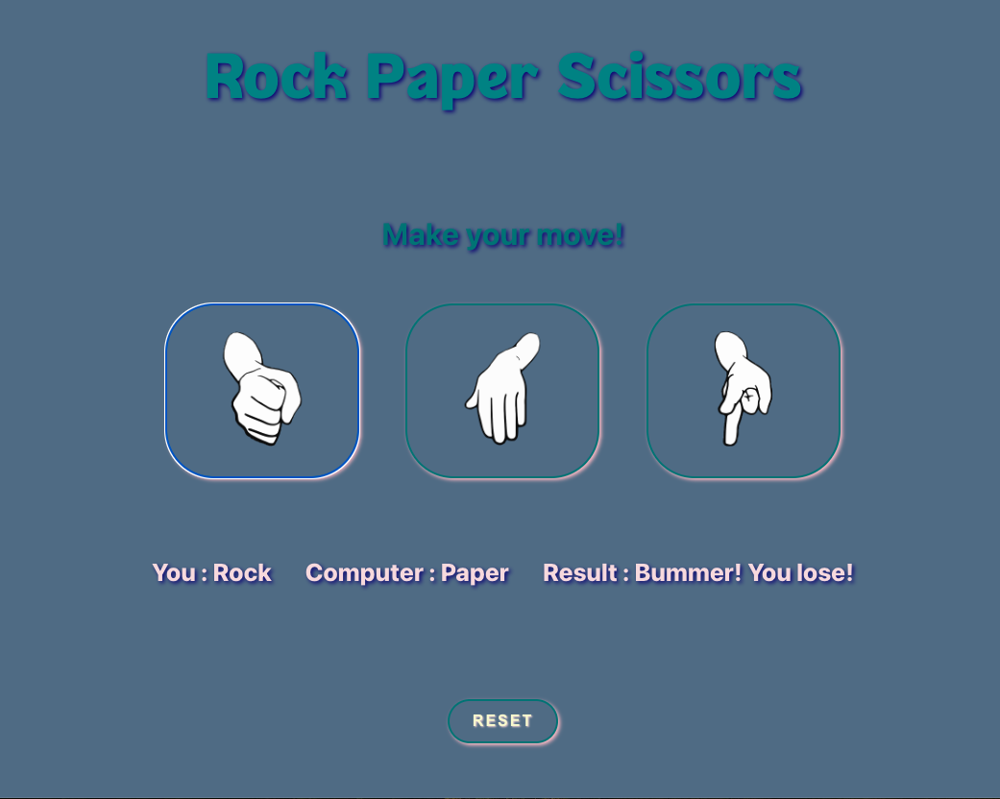

# Rock🪨 Paper📄 Scissors✂️

## Overview

This project implements the classic Rock, Paper, Scissors game using React, TypeScript, and CSS. The user plays against the computer by selecting their choice through respective buttons. The game board displays both the user's and the computer's choices, as well as the result. A reset button allows the game to restart. The design is freestyle and customizable.

## Preview

or check it out on Netlify : [Rock Paper Scissors](https://basic-rock-paper-scissors-react-ts.netlify.app/)

## Features

- Interactive Gameplay: Users can select Rock, Paper, or Scissors.

- Computer Opponent: The computer makes a random selection for each round.

- Result Display: Shows the choices of both the user and the computer, along with the game result (win, lose, tie).

- Reset Functionality: Allows the game to restart with a simple click.

- Freestyle Design: The design is flexible and can be customized as desired.

## Technologies Used

- React: For building the user interface.

- TypeScript: To add static typing and improve code quality.

- CSS: For styling the components and game board.

## How to Run the Project

1. Clone the repository:
   `git clone https://github.com/your-username/rock-paper-scissors.git`

2. Navigate to the project directory:
   `cd rock-paper-scissors`

3. Install dependencies:
   `npm install`

4. Start the development server:
   `npm start`

5. Open your browser to see the game in action.

## Game Rules

- Rock beats Scissors

- Scissors beats Paper

- Paper beats Rock

- Identical choices result in a tie

## Contributing

Feel free to fork the repository, make improvements, and submit a pull request. Contributions are welcome!
